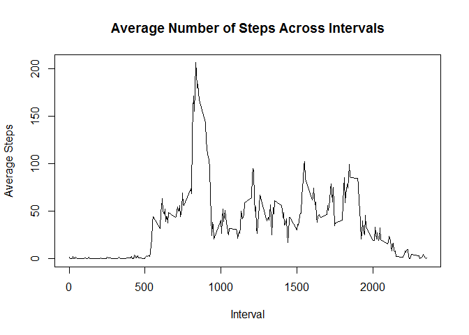

# Reproducible Research Week 2: Course Project 1
Chris Batty  
November 21, 2016  


#Import Data


```r
activity_data <- read.csv("activity.csv")
```

#Mean Total Number of Steps Taken Per Day

Calculate the total steps by day and display with a histogram.

```r
total_steps <- with(activity_data[is.na(activity_data[,1])==0,], 
                    aggregate(steps, by = list(date), FUN = 'sum'))
names(total_steps) <- c('Date', 'Total_Steps')


hist(total_steps$Total_Steps, breaks = 15, main = 'Histogram of Total Steps Per Day',
     xlab = 'Total Steps')
```

<!-- -->


```r
step_mean <- as.integer(mean(total_steps$Total_Steps))

step_median <- median(total_steps$Total_Steps)
```


The mean total steps per day is 10766 and the median total steps is 10765.


#Average Daily Activity Pattern


```r
mean_step <- with(activity_data[is.na(activity_data[,1])==0,], 
                    aggregate(steps, by = list(interval), FUN = 'mean'))

names(mean_step)<- c('Interval', 'Mean_Steps')


with(mean_step, plot(Interval, Mean_Steps, type = 'l', main = 'Average Number of Steps Across Intervals', ylab = 'Average Steps'))
```

<!-- -->


```r
max_step <- max(mean_step$Mean_Steps)

max_interval <- mean_step[mean_step$Mean_Steps == max_step,1]
```

The interval with the largest average number of steps is 'r max_interval'.


#Impute Values


```r
missing_total <-sum(is.na(activity_data[,1]))
```


The total number of missing values is 'r missing_total'.

We will impute the average for the interval for the rows with missing data and create a new dataset.


```r
missing_index <- is.na(activity_data[,1])

#Create Copy of Original Data
activity_complete <- activity_data

#Pull mean values from mean_step in for missing values
activity_complete$steps[missing_index] <- mean_step[mean_step$Interval %in% activity_data$interval[missing_index],2]
```

We will now recreate the histogram from above with the imputed values, as well as the average and median.


```r
total_steps_comp <- with(activity_complete[is.na(activity_data[,1])==0,], 
                    aggregate(steps, by = list(date), FUN = 'sum'))

names(total_steps_comp) <- c('Date', 'Total_Steps')


hist(total_steps_comp$Total_Steps, breaks = 15, main = 'Histogram of Total Steps Per Day: Imputed Values',
     xlab = 'Total Steps')
```

<!-- -->


```r
step_mean_c <- as.integer(mean(total_steps_comp$Total_Steps))

step_median_c <- median(total_steps_comp$Total_Steps)
```

The new average is 10766 and the new median is 1.0765\times 10^{4}.  As we can see imputing these values has pushed the median to match the average.


#Difference in Activity Pattern: Weekday vs Weekend

We first need to identify which dates belong to Weekdays and which belong to Weekends.


```r
weekday_check <- function(x) {
    day_name <- weekdays(as.Date(x))
    ifelse (day_name  == "Saturday" | day_name  == "Sunday", "Weekend", "Weekday")
}

day_list <- weekday_check(activity_complete$date)

activity_complete$day <- as.factor(day_list)
```


Next we create a panel plot comparing the average number of steps on Weekdays to Weekends by interval.


```r
mean_steps_c <- with(activity_complete, aggregate(steps, by = list(interval, day), FUN = 'mean'))

names(mean_steps_c) <- c('Interval', 'Day', 'Steps')


library(ggplot2)

ggplot(mean_steps_c, aes(Interval, Steps)) +
  geom_line() +
  facet_grid(Day~.) +
  ylab('Average Steps')
```

<!-- -->
